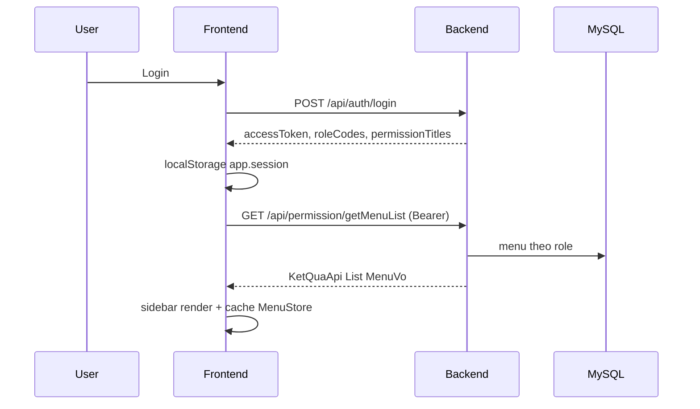

# RBAC — Menu & Phân quyền

Hệ thống dùng **menu động từ DB** + **token session** + **ẩn nút theo permission title**.

## Luồng tổng quát



## Vai trò (role codes)

| Code | Mô tả |
|------|-------|
| `ADMIN` | Toàn quyền; bypass kiểm tra `AppPerm` |
| `MANAGER` | Quản lý |
| `STAFF` | Cán bộ quản lý tài sản |
| `STUDENT` | Sinh viên (yêu cầu xử lý) |

Seed trong `database/mysql/schema.sql` — bảng `roles`, `users`, `role_permissions`.

Frontend chọn role điều hướng: `AppAuth.deriveNavigationRole()` — ưu tiên ADMIN → MANAGER → STAFF → STUDENT.

## Menu API

### Menu theo user đăng nhập

```
GET /api/permission/getMenuList
Authorization: Bearer <token>
```

**Response:** `KetQuaApi<List<VoMenu>>`

```json
{
  "success": true,
  "result": [
    {
      "id": 1,
      "parentId": null,
      "title": "Tài sản",
      "name": "nav_assets",
      "path": "/dashboard/assets",
      "permissionType": 0,
      "sortOrder": 10,
      "level": 1,
      "status": 0,
      "icon": "...",
      "children": []
    }
  ]
}
```

### Menu đầy đủ (quản trị vai trò)

```
GET /api/admin/menu-tree
```

Chỉ role `ADMIN` (interceptor `BoLocPhienToken`).

## VoMenu fields

| Field | Ý nghĩa |
|-------|---------|
| `permissionType` | `0` = menu/trang, `1` = nút thao tác (operation) |
| `path` | Route logic — map sang file HTML trong `sidebar.js` |
| `name` | Mã menu (vd. `page_building_e1`) |
| `title` | Nhãn hiển thị (có thể i18n qua sidebar) |
| `status` | Trạng thái bật/tắt |
| `children` | Menu con |

## Frontend components

| Module | File | Vai trò |
|--------|------|---------|
| Menu cache | `shared/menu-store.js` | Cache cây menu localStorage, TTL 10 phút |
| Sidebar | `shared/sidebar.js` | Render menu, map path → HTML, i18n title |
| Menu links | `shared/menu-links.js` | Hash categories/assets, link tòa nhà |
| Permission UI | `shared/permission.js` | `AppPerm.hasPerm()`, `data-perm` |
| RBAC admin | `shared/rbac-api.js` | Helper gọi `/api/admin/*` |
| RBAC page | `pages/rbac-roles-page.js` | UI quản lý vai trò |

## Cache menu

| Key localStorage | Nội dung |
|------------------|----------|
| `app.menuTree` | JSON cây menu |
| `app.menuTreeTs` | Timestamp |
| `app.menuTreeVer` | Version cache (hiện `"4"`) |

Invalidate: đăng xuất, CRUD role, đổi version trong code.

Event: `fm-sidebar-ready` — sidebar render xong; `menu-links.js` lắng nghe để fix link tòa.

## Phân quyền nút (`AppPerm`)

HTML:

```html
<button data-perm="Thêm">...</button>
<button data-perm="Sửa Xóa">...</button>
```

Logic (`permission.js`):

1. `ADMIN` → luôn hiện
2. Token login có `permissionTitles` → so khớp chuỗi
3. Cache menu `MenuStore.getCachedPermTitles()` — gom title từ node `permissionType === 1`

Gọi `AppPerm.applyToDOM()` sau render bảng / modal.

Trang dùng: `rbac-roles.html`, `student/request-*.html`, `index.html`.

## Guard trang (`guard.js`)

Khác với RBAC menu — guard theo **role code** cố định trên `<body data-required-roles="...">`.

Ví dụ trang dashboard staff:

```html
<body data-required-roles="ADMIN,MANAGER,STAFF">
```

Student pages thường chỉ `STUDENT` hoặc không guard (tùy trang).

## Admin API vai trò

| Method | Path | Body |
|--------|------|------|
| GET | `/api/admin/roles` | — |
| POST | `/api/admin/roles` | `YeuCauTaoVaiTro` |
| PUT | `/api/admin/roles/{id}` | `YeuCauCapNhatVaiTro` |
| DELETE | `/api/admin/roles/{id}` | — |

Frontend gọi qua `AppAuth.rbacFetch()` + `RbacApi` helpers.

## Nguồn dữ liệu menu

- **Khởi tạo:** `database/mysql/schema.sql` — bảng `app_menus`, `role_menu`, …
- **Không** dùng Flyway; cập nhật schema SQL trực tiếp khi thêm menu mới

Khi thêm trang mới:

1. Thêm menu + permission trong `schema.sql`
2. Thêm entry `PATH_TO_PAGE` trong `sidebar.js`
3. Tạo file HTML + JS
4. (Tuỳ chọn) thêm key i18n `menu.*` trong `locales/*.json`

## Sidebar — menu bị ẩn

`sidebar.js` loại bỏ nhóm menu có title/code `phòng` / `room` / `nav_room_*` (`shouldStripRoomNavNode`) — menu tòa render riêng qua submenu tòa nhà.
